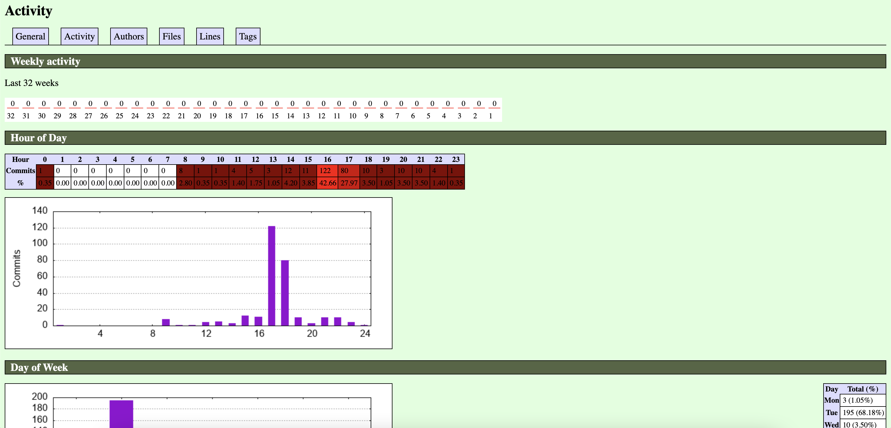
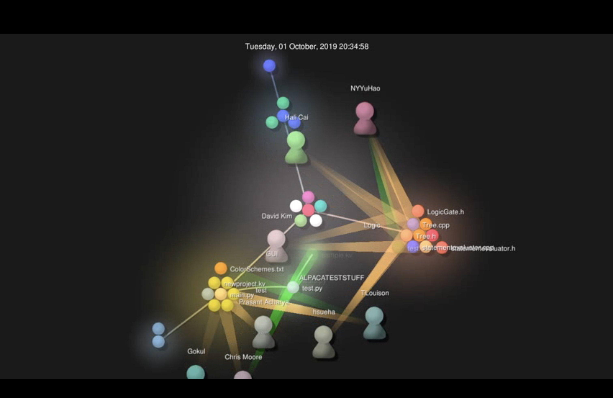

My project: rpi-alpaca/alpaca
Total lines: 7205 (including image files; 2366 without image files)
Total contributors: 15
First commit: "Initial commit" a8b820a9c12f26ee5861a3cd511dd36805705468
Latest commit: "Merge pull request #16 from hjung4/fixmedia2..." 550d1c4f06c0697f5c9e638a98cce34bb2fa5fee
Current branches: master

Gitstats report:
Total lines of code: 2383
Total contributors: 21
First commit: I couldn't find the first commit message/hash, but it occurred at 2019-09-12 08:14:55
Latest commit: I couldn't find the latest commit message/hash, but it occurred at 2020-01-29 19:03:21
Current branches: Total number of branches is not listed.

Gitstats screenshot:

Gource screenshot:

