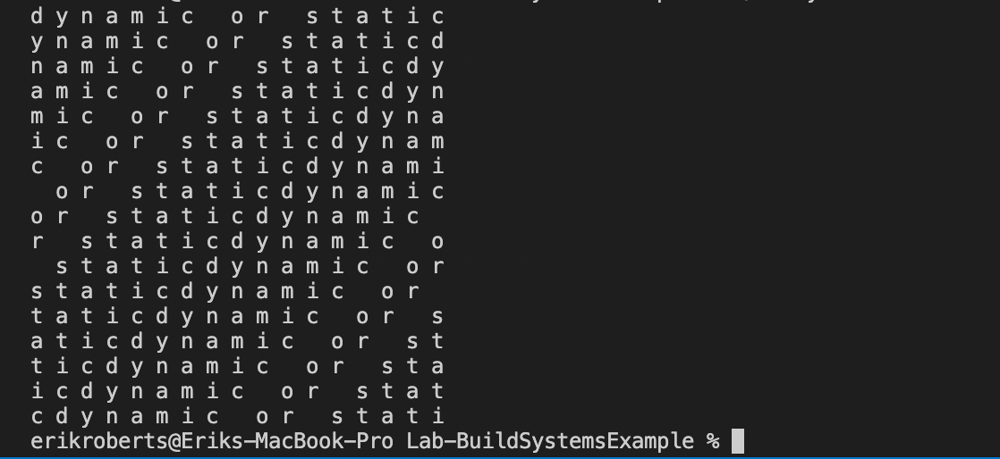

# Lab 5

## Part 1


<hr>


<hr>


<hr>


<hr>


<hr>


## Part 2

### Makefile

```Makefile
all: LabDynamic LabStatic
clean:
		rm LabDynamic LabStatic program.o block.o block.a block.so
LabDynamic: program.o block.so
		cc program.o block.so -o LabDynamic -Wl,-rpath,'$$ORIGIN'
LabStatic: program.o block.a
		cc program.o block.a -o LabStatic
program.o: program.c
		cc -c program.c -o program.o
block.o: source/block.c
		cc -c source/block.c -o block.o
block.so: block.o
		cc -shared -o block.so block.o
block.a: block.o
		ar qc block.a block.o
```

### CMakeLists.txt
```CMake
cmake_minimum_required(VERSION 3.10)

# set the project name
project(LabStatic VERSION 1.0)
project(LabDynamic VERSION 1.0)

add_subdirectory(source)

# add the executable
add_executable(LabStatic program.c)
add_executable(LabDynamic program.c)

target_link_libraries(LabStatic PUBLIC BlockStatic)
target_link_libraries(LabDynamic PUBLIC BlockDynamic)

# add the binary tree to the search path for include files
# so that we will find TutorialConfig.h
target_include_directories(LabStatic PUBLIC
                          "${PROJECT_BINARY_DIR}"
                          "${PROJECT_SOURCE_DIR}/source"
                          "${PROJECT_SOURCE_DIR}/headers"
                          )

target_include_directories(LabDynamic PRIVATE
                          "${PROJECT_BINARY_DIR}"
                          "${PROJECT_SOURCE_DIR}/source"
                          "${PROJECT_SOURCE_DIR}/headers"
                          )
```

### source/CMakeLists.txt

```CMake
add_library(BlockStatic block.c)
add_library(BlockDynamic SHARED block.c)
set_target_properties(BlockDynamic PROPERTIES PUBLIC_HEADER ../headers/block.h)
```

### CMake Output
```Makefile
# CMAKE generated file: DO NOT EDIT!
# Generated by "Unix Makefiles" Generator, CMake Version 3.22

# Default target executed when no arguments are given to make.
default_target: all
.PHONY : default_target

# Allow only one "make -f Makefile2" at a time, but pass parallelism.
.NOTPARALLEL:

#=============================================================================
# Special targets provided by cmake.

# Disable implicit rules so canonical targets will work.
.SUFFIXES:

# Disable VCS-based implicit rules.
% : %,v

# Disable VCS-based implicit rules.
% : RCS/%

# Disable VCS-based implicit rules.
% : RCS/%,v

# Disable VCS-based implicit rules.
% : SCCS/s.%

# Disable VCS-based implicit rules.
% : s.%

.SUFFIXES: .hpux_make_needs_suffix_list

# Command-line flag to silence nested $(MAKE).
$(VERBOSE)MAKESILENT = -s

#Suppress display of executed commands.
$(VERBOSE).SILENT:

# A target that is always out of date.
cmake_force:
.PHONY : cmake_force

#=============================================================================
# Set environment variables for the build.

# The shell in which to execute make rules.
SHELL = /bin/sh

# The CMake executable.
CMAKE_COMMAND = /opt/homebrew/Cellar/cmake/3.22.2/bin/cmake

# The command to remove a file.
RM = /opt/homebrew/Cellar/cmake/3.22.2/bin/cmake -E rm -f

# Escaping for special characters.
EQUALS = =

# The top-level source directory on which CMake was run.
CMAKE_SOURCE_DIR = /Users/erikroberts/Library/CloudStorage/OneDrive-Personal/Documents/RPI/Spring22/CSCI4470/CSCI-4470-OpenSource/Modules/05.BuildSystems/Lab-BuildSystemsExample

# The top-level build directory on which CMake was run.
CMAKE_BINARY_DIR = /Users/erikroberts/Library/CloudStorage/OneDrive-Personal/Documents/RPI/Spring22/CSCI4470/CSCI-4470-OpenSource/Modules/05.BuildSystems/Lab-BuildSystemsExample/build

#=============================================================================
# Targets provided globally by CMake.

# Special rule for the target edit_cache
edit_cache:
	@$(CMAKE_COMMAND) -E cmake_echo_color --switch=$(COLOR) --cyan "Running CMake cache editor..."
	/opt/homebrew/Cellar/cmake/3.22.2/bin/ccmake -S$(CMAKE_SOURCE_DIR) -B$(CMAKE_BINARY_DIR)
.PHONY : edit_cache

# Special rule for the target edit_cache
edit_cache/fast: edit_cache
.PHONY : edit_cache/fast

# Special rule for the target rebuild_cache
rebuild_cache:
	@$(CMAKE_COMMAND) -E cmake_echo_color --switch=$(COLOR) --cyan "Running CMake to regenerate build system..."
	/opt/homebrew/Cellar/cmake/3.22.2/bin/cmake --regenerate-during-build -S$(CMAKE_SOURCE_DIR) -B$(CMAKE_BINARY_DIR)
.PHONY : rebuild_cache

# Special rule for the target rebuild_cache
rebuild_cache/fast: rebuild_cache
.PHONY : rebuild_cache/fast

# The main all target
all: cmake_check_build_system
	$(CMAKE_COMMAND) -E cmake_progress_start /Users/erikroberts/Library/CloudStorage/OneDrive-Personal/Documents/RPI/Spring22/CSCI4470/CSCI-4470-OpenSource/Modules/05.BuildSystems/Lab-BuildSystemsExample/build/CMakeFiles /Users/erikroberts/Library/CloudStorage/OneDrive-Personal/Documents/RPI/Spring22/CSCI4470/CSCI-4470-OpenSource/Modules/05.BuildSystems/Lab-BuildSystemsExample/build//CMakeFiles/progress.marks
	$(MAKE) $(MAKESILENT) -f CMakeFiles/Makefile2 all
	$(CMAKE_COMMAND) -E cmake_progress_start /Users/erikroberts/Library/CloudStorage/OneDrive-Personal/Documents/RPI/Spring22/CSCI4470/CSCI-4470-OpenSource/Modules/05.BuildSystems/Lab-BuildSystemsExample/build/CMakeFiles 0
.PHONY : all

# The main clean target
clean:
	$(MAKE) $(MAKESILENT) -f CMakeFiles/Makefile2 clean
.PHONY : clean

# The main clean target
clean/fast: clean
.PHONY : clean/fast

# Prepare targets for installation.
preinstall: all
	$(MAKE) $(MAKESILENT) -f CMakeFiles/Makefile2 preinstall
.PHONY : preinstall

# Prepare targets for installation.
preinstall/fast:
	$(MAKE) $(MAKESILENT) -f CMakeFiles/Makefile2 preinstall
.PHONY : preinstall/fast

# clear depends
depend:
	$(CMAKE_COMMAND) -S$(CMAKE_SOURCE_DIR) -B$(CMAKE_BINARY_DIR) --check-build-system CMakeFiles/Makefile.cmake 1
.PHONY : depend

#=============================================================================
# Target rules for targets named LabStatic

# Build rule for target.
LabStatic: cmake_check_build_system
	$(MAKE) $(MAKESILENT) -f CMakeFiles/Makefile2 LabStatic
.PHONY : LabStatic

# fast build rule for target.
LabStatic/fast:
	$(MAKE) $(MAKESILENT) -f CMakeFiles/LabStatic.dir/build.make CMakeFiles/LabStatic.dir/build
.PHONY : LabStatic/fast

#=============================================================================
# Target rules for targets named LabDynamic

# Build rule for target.
LabDynamic: cmake_check_build_system
	$(MAKE) $(MAKESILENT) -f CMakeFiles/Makefile2 LabDynamic
.PHONY : LabDynamic

# fast build rule for target.
LabDynamic/fast:
	$(MAKE) $(MAKESILENT) -f CMakeFiles/LabDynamic.dir/build.make CMakeFiles/LabDynamic.dir/build
.PHONY : LabDynamic/fast

#=============================================================================
# Target rules for targets named BlockStatic

# Build rule for target.
BlockStatic: cmake_check_build_system
	$(MAKE) $(MAKESILENT) -f CMakeFiles/Makefile2 BlockStatic
.PHONY : BlockStatic

# fast build rule for target.
BlockStatic/fast:
	$(MAKE) $(MAKESILENT) -f source/CMakeFiles/BlockStatic.dir/build.make source/CMakeFiles/BlockStatic.dir/build
.PHONY : BlockStatic/fast

#=============================================================================
# Target rules for targets named BlockDynamic

# Build rule for target.
BlockDynamic: cmake_check_build_system
	$(MAKE) $(MAKESILENT) -f CMakeFiles/Makefile2 BlockDynamic
.PHONY : BlockDynamic

# fast build rule for target.
BlockDynamic/fast:
	$(MAKE) $(MAKESILENT) -f source/CMakeFiles/BlockDynamic.dir/build.make source/CMakeFiles/BlockDynamic.dir/build
.PHONY : BlockDynamic/fast

program.o: program.c.o
.PHONY : program.o

# target to build an object file
program.c.o:
	$(MAKE) $(MAKESILENT) -f CMakeFiles/LabStatic.dir/build.make CMakeFiles/LabStatic.dir/program.c.o
	$(MAKE) $(MAKESILENT) -f CMakeFiles/LabDynamic.dir/build.make CMakeFiles/LabDynamic.dir/program.c.o
.PHONY : program.c.o

program.i: program.c.i
.PHONY : program.i

# target to preprocess a source file
program.c.i:
	$(MAKE) $(MAKESILENT) -f CMakeFiles/LabStatic.dir/build.make CMakeFiles/LabStatic.dir/program.c.i
	$(MAKE) $(MAKESILENT) -f CMakeFiles/LabDynamic.dir/build.make CMakeFiles/LabDynamic.dir/program.c.i
.PHONY : program.c.i

program.s: program.c.s
.PHONY : program.s

# target to generate assembly for a file
program.c.s:
	$(MAKE) $(MAKESILENT) -f CMakeFiles/LabStatic.dir/build.make CMakeFiles/LabStatic.dir/program.c.s
	$(MAKE) $(MAKESILENT) -f CMakeFiles/LabDynamic.dir/build.make CMakeFiles/LabDynamic.dir/program.c.s
.PHONY : program.c.s

# Help Target
help:
	@echo "The following are some of the valid targets for this Makefile:"
	@echo "... all (the default if no target is provided)"
	@echo "... clean"
	@echo "... depend"
	@echo "... edit_cache"
	@echo "... rebuild_cache"
	@echo "... BlockDynamic"
	@echo "... BlockStatic"
	@echo "... LabDynamic"
	@echo "... LabStatic"
	@echo "... program.o"
	@echo "... program.i"
	@echo "... program.s"
.PHONY : help


#=============================================================================
# Special targets to cleanup operation of make.

# Special rule to run CMake to check the build system integrity.
# No rule that depends on this can have commands that come from listfiles
# because they might be regenerated.
cmake_check_build_system:
	$(CMAKE_COMMAND) -S$(CMAKE_SOURCE_DIR) -B$(CMAKE_BINARY_DIR) --check-build-system CMakeFiles/Makefile.cmake 0
.PHONY : cmake_check_build_system
```

### Relative Sizes
The dynamically-linked file created by my Makefile is 33,447 bytes, while the statically-linked file is 33,526 bytes.

### Output

The output is the same from both programs.

