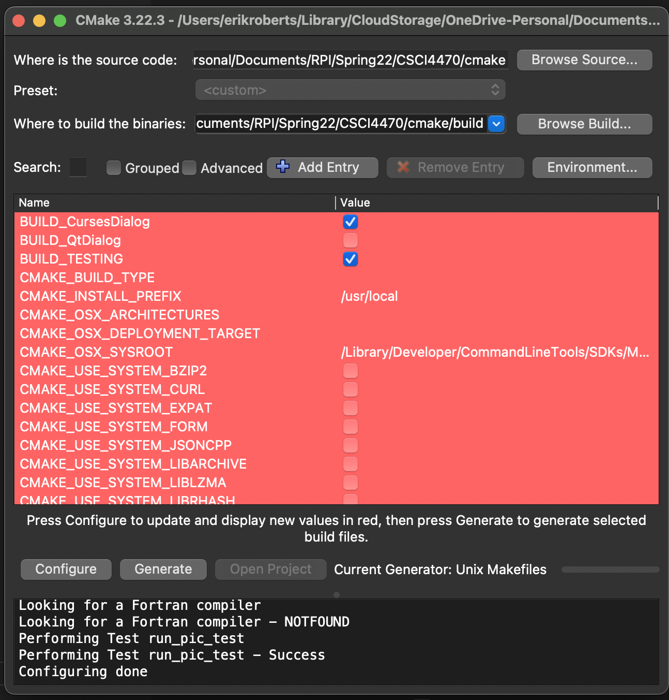
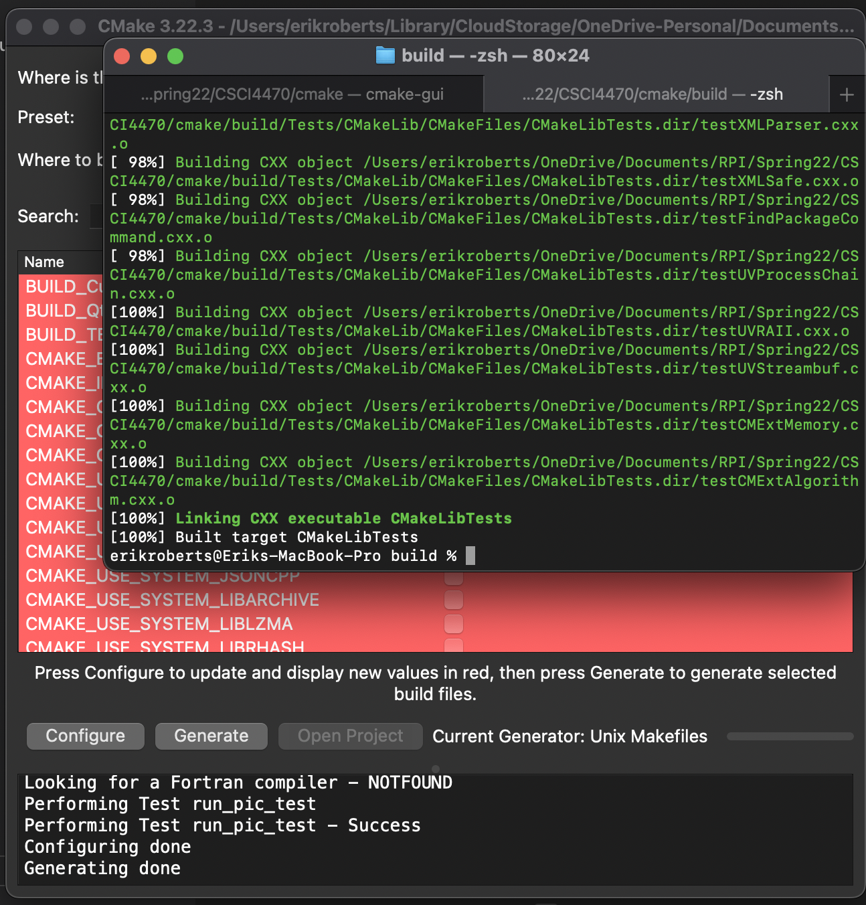
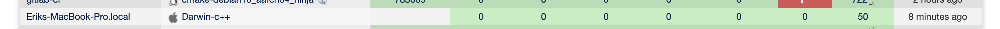
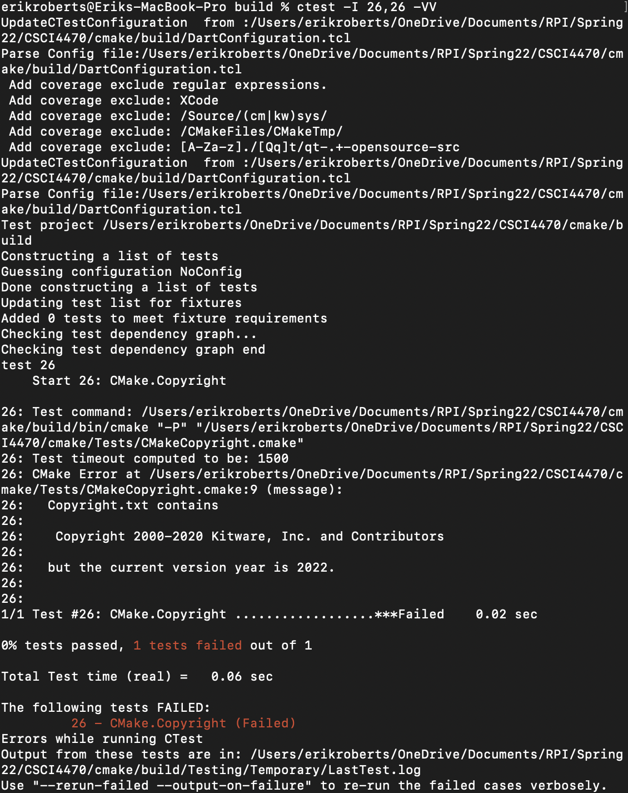
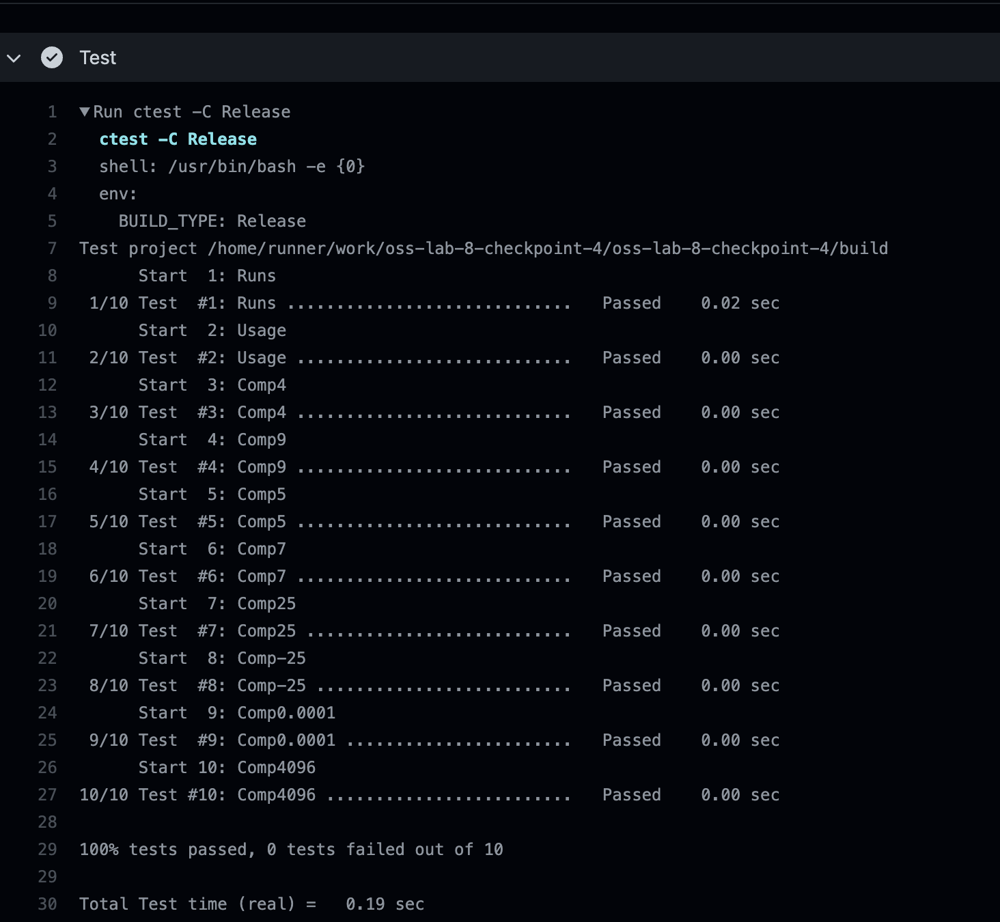
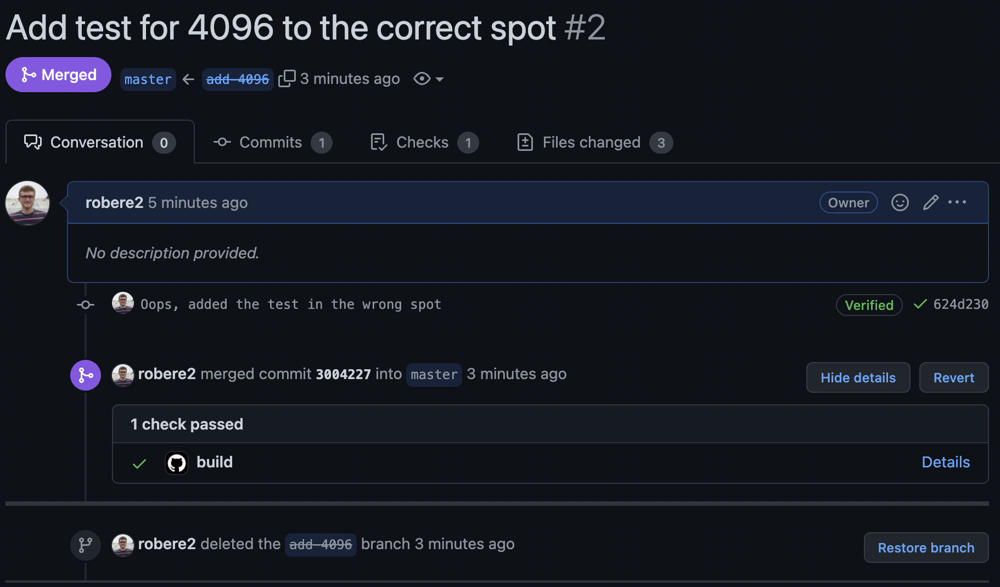

# Lab 8

## Part 1

## Part 2

1. Each section appears to list the source that ran the build test, and what its results were. When you click on a number in one of the columns, for example the number of passed tests, you can see which tests in particular passed. 
2. In the build `cmake-fedora35_makefiles`, four tests failed. Those tests appear to be named: `FindPython.PyPy.V3.LOCATION`, `FindPython.PyPy.V3.VERSION`, `FindPython.PyPy3.LOCATION`, `FindPython.PyPy3.VERSION`. I'm not quite sure why it failed, however. You can click on the status to see the output, and, as the name implies, it appears it's not able to locate the Python installation? Here is a link to the specific build ID. https://open.cdash.org/viewTest.php?onlyfailed&buildid=7798137
3. There are no test failures on master for the environment closest to what I am using. https://open.cdash.org/build/7796725

There are no errors.

https://open.cdash.org/build/7798313

## Part 3

To start I ran the suggested command, `ctest -I 1,50` but this didn't really provide much info other than the fact that test 26 failed. I wasn't able to find my test on the dashboard. Perhaps because I didn't pass the experimental flag like last time? Anyway, I tweaked the command and this time ran `ctest -I 26,26 -VV`. This time I got the following output:

This tells me the error. So I updated the year in the Copyright.txt file, then re-ran it and it worked. To be sure, I re-ran all 50 tests again using the first command.

## Part 4

My repository: 

https://github.com/robere2/oss-lab-8-checkpoint-4/

I was a bit confused for this step. I copied the Step5 folder from the cmake tutorials directory and committed that to Github. There were 9 tests built in, all of which passed. I used the auto-generated CMake GitHub action, and it passed as well. I verified to make sure it both builds and runs the tests, and it does.

I added an additional test to CMakeLists.txt for 4096. I ran it and it appeared to work, so I pushed it to a new branch and created a PR, found here: https://github.com/robere2/oss-lab-8-checkpoint-4/pull/2 The GitHub Action passed as well, so it is now merged into the master branch.

