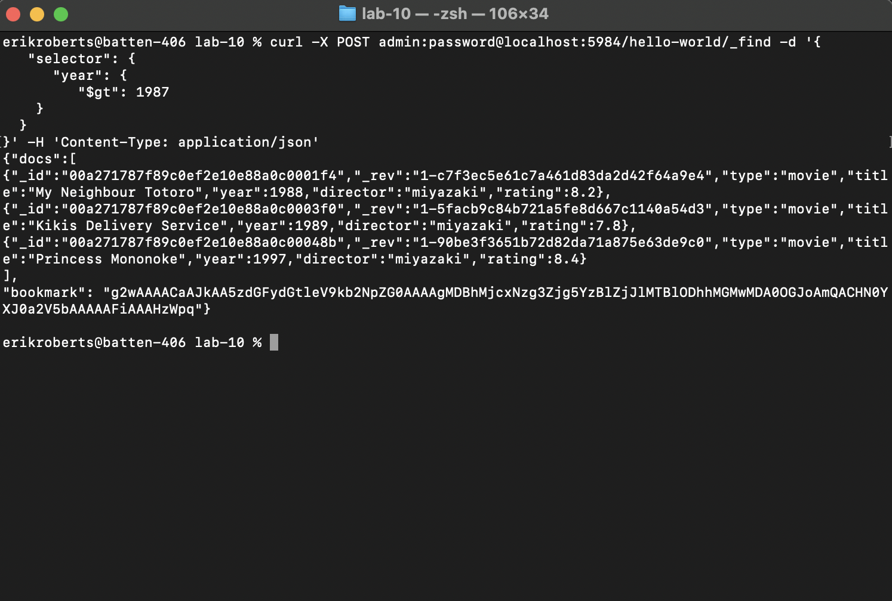

# Lab 10

## Part 0

https://github.com/robere2/oss-repo-template/wiki/Blogs#lab-10

## Part 1

I opted to install using Docker with a docker-compose file. The file is in this folder. My database data is available in the `./db` folder. You should be able to view my work by running `docker compose up`. The credentials are `admin` and `password`.

## Part 2

## Part 3

## Part 4

