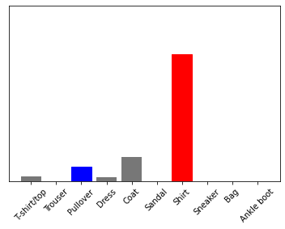
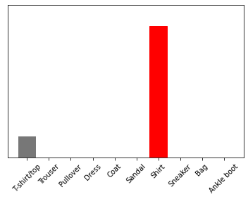
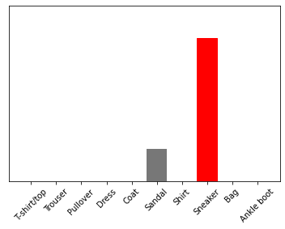
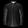
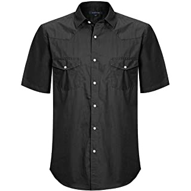
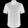

# Lab 11

## Checkpoint 1


## Checkpoint 2

### Tutorial

> I've combined some of the tests for this checkpoint into a single screenshot. 


> It's at this point that I interestingly started to receive (slightly) different input. I am not sure why. Perhaps updated version of tensorflow? I would expect with the same input that I'd get the same output, but maybe I don't know enough about machine learning.


> I've excluded my code from this point forward because it just makes my output harder to read and it doesn't all fit on my screen in one screenshot.


### Prompted Code Modification

```python
# Plot the first X test images, their predicted labels, and the true labels.
# Color correct predictions in blue and incorrect predictions in red.
num_rows = 5
num_cols = 3
num_images = num_rows*num_cols
plt.figure(figsize=(2*2*num_cols, 2*num_rows))
for i in range(num_images):
  plt.subplot(num_rows, 2*num_cols, 2*i+1)
  plot_image(i + 9000, predictions[i + 9000], test_labels, test_images)
  plt.subplot(num_rows, 2*num_cols, 2*i+2)
  plot_value_array(i + 9000, predictions[i + 9000], test_labels)
plt.tight_layout()
plt.show()
```


## Checkpoint 3

Here is the code I used to manipulate my images.

```python
images = ['shirt-1', 'shirt-2', 'sneaker-3']
imagesArray = []
for imgName in images:
  img = Image.open(imgName + '.jpg')
  img = img.resize((28, 28))
  img = ImageOps.grayscale(img)
  img = ImageOps.invert(img)
  img.save(imgName + '-altered.jpg')
  imagesArray.append(np.array(img) / 255)
```

After this, I repeated the steps under "Use the trained model" but using my new images array instead of the `test_images` array.

```python
for img in imagesArray:
  print(img.shape)
  # Add the image to a batch where it's the only member.
  img = (np.expand_dims(img,0))

  print(img.shape)
  predictions_single = probability_model.predict(img)

  print(predictions_single)
  plot_value_array(1, predictions_single[0], test_labels)
  _ = plt.xticks(range(10), class_names, rotation=45)
  plt.show()
```

The highest scoring result for all three images was correct.

```
(28, 28)
(1, 28, 28)
[[3.0060053e-02 1.0835671e-04 8.2792312e-02 2.1464463e-02 1.3892859e-01
  2.1618632e-04 7.2449410e-01 2.7563713e-06 1.8476227e-03 8.5529966e-05]]
```



```
(28, 28)
(1, 28, 28)
[[1.3836549e-01 5.7618830e-11 1.4536196e-05 3.2648461e-06 5.2544042e-06
  3.3226937e-13 8.6161137e-01 1.4308918e-13 1.3886344e-08 1.9434647e-11]]
```



```
(28, 28)
(1, 28, 28)
[[3.1896387e-04 1.0018764e-05 8.8685738e-07 1.1387021e-09 7.3631436e-06
  1.8559822e-01 2.3767032e-06 8.1367171e-01 8.0233745e-05 3.1018103e-04]]
```



Source images:









